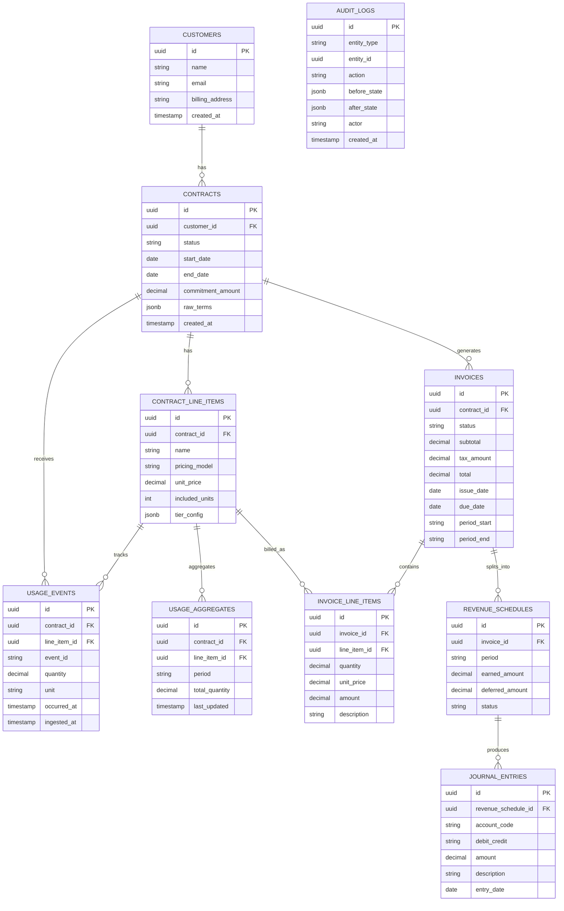

# 📦 RevFlow — Mini Revenue Automation Engine

A **billing + metering + revenue recognition system** with an AI-powered contract parser.

RevFlow simulates a modern SaaS revenue stack:

* Contract-driven billing
* Usage-based metering
* Invoice generation
* Revenue recognition (ASC 606-lite)

---

# 🧭 High-Level Architecture

## Core Components

* **Web App (Next.js 14)**
  Dashboard UI for contracts, invoices, analytics

* **API Server (Express + TypeScript)**
  Central business logic layer

* **Worker (Node + BullMQ)**
  Async processing for usage aggregation, invoicing, revrec

* **PostgreSQL**
  Source of truth (contracts, invoices, revenue data)

* **Redis + BullMQ**
  Queue + background job orchestration

* **AI Layer (Claude/OpenAI)**
  Contract → structured billing config

  


---

## 🔁 Data Flow

```
User → Web → API → DB
                ↓
              Redis Queue → Worker → DB
```

---

# 🏗️ Monorepo Structure

```
revflow/
├── apps/
│   ├── web/                         ← Next.js 14 (port 3000)
│   │   ├── app/
│   │   │   ├── (dashboard)/
│   │   │   │   ├── contracts/
│   │   │   │   ├── invoices/
│   │   │   │   ├── customers/
│   │   │   │   └── analytics/
│   │   │   └── layout.tsx
│   │   ├── components/
│   │   │   ├── ui/                  ← shadcn primitives
│   │   │   └── domain/              ← ContractCard, InvoiceTable etc.
│   │   ├── lib/
│   │   │   └── api-client.ts        ← typed fetch wrapper → apps/api
│   │   └── package.json
│   │
│   ├── api/                         ← Express server (port 4000)
│   │   ├── src/
│   │   │   ├── routes/
│   │   │   │   ├── contracts.ts
│   │   │   │   ├── customers.ts
│   │   │   │   ├── invoices.ts
│   │   │   │   ├── events.ts        ← usage event ingest
│   │   │   │   └── analytics.ts
│   │   │   ├── services/            ← ALL business logic lives here
│   │   │   │   ├── pricing-engine.ts
│   │   │   │   ├── invoice-service.ts
│   │   │   │   ├── revrec-engine.ts
│   │   │   │   └── contracts-ai.ts
│   │   │   ├── middleware/
│   │   │   │   ├── auth.ts
│   │   │   │   └── validate.ts
│   │   │   └── server.ts            ← Express app entry point
│   │   └── package.json
│   │
│   └── worker/                      ← Long-running Node process (no HTTP)
│       ├── src/
│       │   ├── consumers/
│       │   │   ├── usage-aggregator.ts   ← flushes events → aggregates
│       │   │   ├── invoice-generator.ts  ← generates + emails invoices
│       │   │   └── revrec-scheduler.ts   ← month-end journal entries
│       │   └── worker.ts            ← registers all consumers, starts
│       └── package.json
│
├── packages/
│   ├── db/                          ← Postgres client, shared by api + worker
│   │   ├── src/
│   │   │   ├── client.ts            ← postgres.js connection pool
│   │   │   └── migrations/          ← 001_create_schema.sql etc.
│   │   └── package.json
│   │
│   ├── shared/                      ← TypeScript types + Zod schemas
│   │   ├── src/
│   │   │   ├── types/
│   │   │   │   ├── contract.ts
│   │   │   │   ├── invoice.ts
│   │   │   │   └── usage.ts
│   │   │   └── schemas/             ← Zod — validated in api, reused in web
│   │   └── package.json
│   │
│   └── queues/                      ← BullMQ queue + job type definitions
│       ├── src/
│       │   ├── usage-queue.ts
│       │   └── invoice-queue.ts
│       └── package.json
│
├── docker-compose.yml               ← postgres + redis + all three apps
├── turbo.json                       ← Turborepo build orchestration
└── package.json                     ← workspace root
```

---

# 🖥️ Frontend (apps/web)

## Stack

* Next.js 14 (App Router)
* React Server Components
* Tailwind CSS
* shadcn/ui

## Responsibilities

* Pure UI layer
* No business logic
* Typed API calls to backend

## Structure

```
app/
  (dashboard)/
    contracts/
    invoices/
    customers/
    analytics/

components/
  ui/        # primitives
  domain/    # business UI

lib/
  api-client.ts
```

## Key Principles

* ❌ No DB access
* ❌ No domain logic
* ✅ All logic via API

---

# ⚙️ Backend (apps/api)

## Stack

* Express
* TypeScript
* Zod validation
* Raw SQL (postgres.js)

## Architecture

```
routes → services → db
```

## Key Modules

### Routes

* contracts.ts
* customers.ts
* invoices.ts
* events.ts
* analytics.ts

### Services (Core Logic)

* **pricing-engine.ts**
* **invoice-service.ts**
* **revrec-engine.ts**
* **contracts-ai.ts**

👉 All business logic lives here

---

## 🔑 Design Principles

* Thin routes
* Fat services
* Type-safe validation (Zod)
* No ORM magic (explicit SQL)

---

# 🧵 Worker (apps/worker)

## Purpose

Handles async workloads via BullMQ

## Consumers

### 1. Usage Aggregator

* Reads raw usage events
* Aggregates periodically
* Writes to DB

### 2. Invoice Generator

* Generates invoices
* Sends emails (future)

### 3. RevRec Scheduler

* Runs month-end jobs
* Creates journal entries

---

## Characteristics

* No HTTP server
* Shared DB access
* Runs continuously

---

# 🧱 Shared Packages

## 📊 packages/db

* Postgres client
* Migrations
* Shared across API + Worker

## 🧩 packages/shared

* TypeScript types
* Zod schemas
* Single source of truth

## 📬 packages/queues

* BullMQ queue definitions
* Job types

---

# 🧠 Core Features

---

## 1. Contracts AI Parser

### Goal

Convert unstructured contracts → structured billing config

### Flow

```
PDF/Text → AI → JSON config → DB
```

### Extracted Data

* Pricing model
* Billing frequency
* Commitments
* Usage terms

---

## 2. Pricing Engine

### Supports

* Flat-rate
* Tiered pricing
* Usage-based
* Hybrid

### Design

Strategy pattern:

```ts
interface PricingStrategy {
  calculate(input): PriceResult
}
```

Each pricing model = pluggable strategy

---

## 3. Usage Metering Pipeline

### Flow

```
POST /events → Redis → Worker → Postgres
```

### Key Concepts

* **Idempotency**

  * Deduplicate via `event_id`

* **Batching**

  * Flush every N seconds

* **Backpressure**

  * Redis buffering

---

## 4. Invoice Generation

### Inputs

* Contract config
* Usage data

### Output

* Invoice records
* Line items

### Flow

```
Contract + Usage → Pricing Engine → Invoice
```

---

## 5. Revenue Recognition (ASC 606-lite)

### Concept

Split revenue into:

* Deferred
* Earned

### Example

Annual contract → monthly recognition

### Outputs

* Journal entries
* Monthly reports

---

# 🗄️ Database Design (High-Level)

## Core Tables

* contracts
* customers
* pricing_rules
* usage_events
* invoices
* invoice_line_items
* revenue_entries


---

## Relationships

```
Customer → Contracts → Pricing Rules
Contracts → Usage → Invoices → Revenue
```

---

# 🔄 Queue Design

## Queues

* usage-queue
* invoice-queue

## Jobs

* usage aggregation
* invoice generation
* revrec scheduling

---

# 🐳 Infrastructure

## Docker Compose Services

* Postgres
* Redis
* API
* Web
* Worker

  


## Goals

* One-command setup
* Local-first development
* AWS-ready

---

# 📅 Execution Plan (2 Weeks)

## Week 1 — Core Engine

* DB schema
* Pricing engine
* Usage ingestion
* Invoice generation

## Week 2 — Product + AI

* Dashboard UI
* AI contract parser
* Approval workflows
* Docs + demo

---

# 🔐 Non-Functional Considerations

## Scalability

* Horizontal workers
* Queue-based processing

## Reliability

* Idempotent events
* Retryable jobs

## Observability (future)

* Logs
* Metrics
* Job monitoring

---

# 🚀 Future Enhancements

* Multi-tenant support
* Role-based access
* Stripe integration
* Real-time analytics
* Advanced revrec rules
* Webhooks

---

# 🧾 Key Design Decisions

| Area     | Decision                     |
| -------- | ---------------------------- |
| DB       | Raw SQL over ORM             |
| API      | Service-layer architecture   |
| Queue    | BullMQ                       |
| Types    | Shared via monorepo          |
| Frontend | Thin client                  |
| AI       | Contract → config extraction |

---

# 🎯 What This System Demonstrates

* Real-world SaaS billing complexity
* Event-driven architecture
* Async processing pipelines
* Strong backend design (LLD + HLD)
* AI integration in production workflows

---
