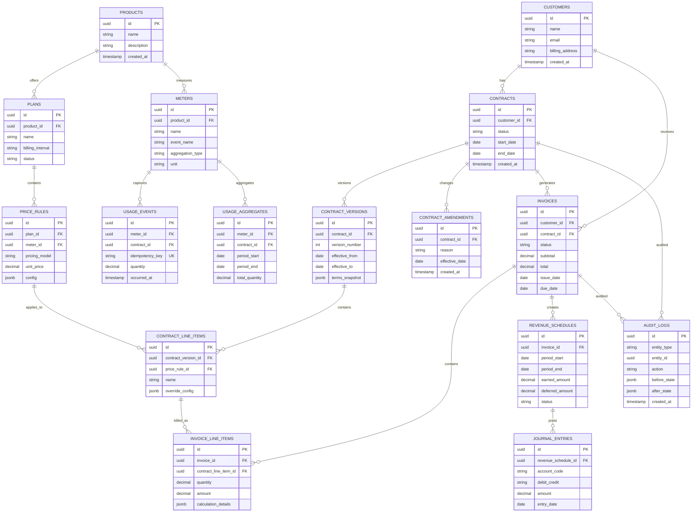

# RevFlow - AI Revenue Automation Workbench

RevFlow is a portfolio-grade proof of concept for a modern B2B SaaS revenue automation platform.

It models the core workflows behind products like flexible billing, usage metering, AI-assisted contract ingestion, invoice generation, and revenue recognition. The goal is not to clone any single company, but to build a credible end-to-end system that demonstrates full-stack product engineering depth in a complex finance domain.

## Product Thesis

Modern SaaS companies increasingly sell through custom contracts:

- Usage-based pricing
- Seat-based pricing
- Minimum commitments
- Prepaid credits
- Free units and overages
- Tiered and volume pricing
- Custom payment terms
- Mid-term amendments
- Revenue recognition requirements

The hard problem is not just calculating a price. The hard problem is helping finance, sales, product, and engineering teams turn messy commercial agreements into correct, auditable, operational billing workflows without constant developer intervention.

RevFlow is designed around that problem.

## Core User Journey

```txt
Contract terms
  -> AI extraction
  -> Human review and approval
  -> Billing configuration
  -> Usage ingestion and aggregation
  -> Draft invoice generation
  -> Invoice approval and issue
  -> Revenue schedule and journal entries
  -> Audit trail and operational visibility
```

## What The System Demonstrates

- End-to-end ownership from data model to user interface
- Complex enterprise configuration UI design
- Type-safe full-stack architecture
- Event-driven usage metering
- Idempotent ingestion and background processing
- Pricing engine design with pluggable strategies
- Invoice lifecycle state management
- Simplified ASC 606-style revenue recognition
- AI-assisted workflows with human approval
- Auditability for finance-grade operations

## High-Level Architecture

```txt
                       +------------------+
                       |   Web App        |
                       |   Next.js        |
                       +---------+--------+
                                 |
                                 v
                       +------------------+
                       |   API Server     |
                       |   Express + TS   |
                       +----+--------+----+
                            |        |
                            v        v
                    +----------+   +--------------+
                    | Postgres |   | Redis/BullMQ |
                    +----+-----+   +------+-------+
                         ^                |
                         |                v
                         |        +---------------+
                         +--------+ Worker        |
                                  | Node + BullMQ |
                                  +---------------+

AI provider is called by the API during contract extraction and review workflows.
```

## Core Components

### Web App

Next.js dashboard for the finance/operator workflow:

- Contract intake
- AI extraction review
- Pricing and meter configuration
- Usage event visibility
- Invoice preview and approval
- Revenue schedule review
- Audit log inspection
- Operational dashboards

The frontend should be product-quality, not a thin demo shell. This is where the project shows senior full-stack judgment: information architecture, state handling, dense enterprise workflows, validation feedback, and clear affordances.

### API Server

Express + TypeScript backend that owns all domain behavior:

- Contract lifecycle
- Product catalog and plan configuration
- Meter definitions
- Pricing calculations
- Usage ingestion
- Invoice generation
- Revenue recognition
- Audit logging
- AI extraction orchestration

Routes stay thin. Services own business rules. Database access is explicit and testable.

### Worker

Long-running Node process for asynchronous work:

- Usage aggregation
- Invoice generation jobs
- Revenue recognition scheduling
- Retryable failed jobs
- Future email and integration jobs

### PostgreSQL

Source of truth for customers, contracts, catalog configuration, meters, usage, invoices, revenue schedules, journal entries, and audit logs.

### Redis + BullMQ

Queue infrastructure for buffering work, absorbing spikes, retrying failed jobs, and decoupling user-facing API latency from background processing.

### AI Layer

AI extracts structured billing and revenue terms from pasted/uploaded contract text.

The AI does not directly activate billing. It produces a draft configuration that must be reviewed, corrected, and approved by a human user.

## Monorepo Structure

```txt
revflow/
  apps/
    web/                         # Next.js 14 dashboard
      app/
        (dashboard)/
          contracts/
          catalog/
          meters/
          invoices/
          revenue/
          usage/
          audit/
      components/
        ui/                      # shadcn/ui primitives
        domain/                  # workflow-specific components
      lib/
        api-client.ts

    api/                         # Express API
      src/
        modules/
          contracts/
          catalog/
          pricing/
          metering/
          invoicing/
          revrec/
          ai/
          audit/
        middleware/
        server.ts

    worker/                      # BullMQ consumers
      src/
        consumers/
          usage-aggregator.ts
          invoice-generator.ts
          revrec-scheduler.ts
        worker.ts

  packages/
    db/                          # Postgres client and migrations
    shared/                      # TypeScript types and Zod schemas
    queues/                      # BullMQ queue definitions and job types

  docker-compose.yml
  turbo.json
  package.json
```

## Domain Model

### Commercial Configuration

- `customers`
- `products`
- `meters`
- `plans`
- `price_rules`
- `contracts`
- `contract_versions`
- `contract_line_items`
- `contract_amendments`

### Usage Metering

- `usage_events`
- `usage_aggregates`
- `meter_definitions`

### Billing

- `invoices`
- `invoice_line_items`
- `invoice_adjustments`
- `credit_notes`

### Revenue Recognition

- `performance_obligations`
- `revenue_schedules`
- `journal_entries`

### Operations

- `audit_logs`
- `job_runs`
- `ai_extraction_runs`

## Key Workflows

### 1. AI Contract Intake

User uploads or pastes contract terms. The AI extracts:

- Customer and contract dates
- Billing frequency
- Payment terms
- Product or plan references
- Usage meters
- Pricing rules
- Minimum commitments
- Free units
- Overage rules
- Revenue recognition method
- Ambiguous clauses and confidence markers

Output is a draft billing configuration, not an active contract.

### 2. Human Review And Approval

Finance user reviews the AI output in a structured UI:

- Accept, edit, or reject extracted fields
- Resolve ambiguous terms
- Preview invoice impact
- Preview revenue schedule
- Approve contract activation

Every approval and edit writes to the audit log.

### 3. Product Catalog And Pricing Configuration

RevFlow separates reusable catalog configuration from customer-specific contracts:

- Products define what is sold
- Meters define what is measured
- Plans define reusable commercial packages
- Price rules define calculation behavior
- Contracts can override plan defaults for enterprise deals

Supported pricing models:

- Flat recurring fee
- Per-seat pricing
- Pay-as-you-go usage
- Tiered pricing
- Volume pricing
- Included units plus overage
- Minimum commitment
- Prepaid credit burn-down
- Hybrid subscription plus usage

### 4. Usage Metering

```txt
POST /events
  -> validate event
  -> dedupe by idempotency key
  -> enqueue aggregation job
  -> aggregate by meter, customer, contract, and period
  -> expose usage for invoice generation
```

Important concerns:

- Idempotency
- Backpressure
- Late-arriving events
- Period boundaries
- Aggregation correctness
- Query performance

### 5. Invoice Lifecycle

Invoices are generated as drafts first.

```txt
draft -> approved -> issued -> paid
      -> void
      -> credited
```

Draft invoices can be inspected before issue:

- Source contract
- Billing period
- Usage totals
- Pricing rule applied
- Line item calculations
- Manual adjustments
- Taxes placeholder
- Revenue recognition impact

### 6. Revenue Recognition

RevFlow implements ASC 606-lite behavior for portfolio and interview purposes.

Recognition methods:

- Immediate recognition
- Straight-line over service period
- Usage-based recognition
- Milestone-based recognition

Outputs:

- Revenue schedules
- Earned vs deferred revenue
- Journal entries
- Monthly revenue reports

### 7. Audit And Operations

Finance systems must be explainable.

Audit logs track:

- Contract changes
- AI extraction approval
- Pricing rule edits
- Invoice adjustments
- Invoice state transitions
- Revenue schedule generation

Operational views track:

- Failed usage events
- Queue jobs
- Invoice generation runs
- Revrec scheduler runs

## API Design

Representative endpoints:

```txt
POST   /contracts/extractions
GET    /contracts/extractions/:id
POST   /contracts/:id/approve

GET    /catalog/products
POST   /catalog/products
GET    /catalog/plans
POST   /catalog/plans

POST   /meters
GET    /meters

POST   /events
GET    /usage/aggregates

POST   /invoices/generate
GET    /invoices
GET    /invoices/:id
POST   /invoices/:id/approve
POST   /invoices/:id/issue

GET    /revenue/schedules
POST   /revenue/schedules/generate

GET    /audit
```

## Pricing Engine Design

The pricing engine should be deterministic, testable, and isolated from HTTP concerns.

```ts
interface PricingStrategy<TConfig, TUsage> {
  calculate(input: {
    config: TConfig;
    usage: TUsage;
    period: BillingPeriod;
    contractContext: ContractContext;
  }): PriceResult;
}
```

Each pricing model is implemented as a separate strategy:

- `FlatRateStrategy`
- `SeatBasedStrategy`
- `UsageBasedStrategy`
- `TieredUsageStrategy`
- `VolumePricingStrategy`
- `MinimumCommitmentStrategy`
- `CreditBurndownStrategy`
- `HybridPricingStrategy`

## Database Design Sketch



## Non-Functional Requirements

### Correctness

- Pricing calculations must be deterministic
- Invoice generation should be repeatable for the same inputs
- Usage ingestion must be idempotent
- Financial state transitions should be explicit

### Reliability

- Queue jobs should be retryable
- Failed jobs should be inspectable
- Background workers should be horizontally scalable
- Duplicate events should not double bill customers

### Performance

- Usage events should be batchable
- Aggregates should be query-friendly
- Dashboard endpoints should avoid heavy transactional scans
- Pricing engine should be testable with large synthetic usage inputs

### Auditability

- All finance-impacting changes are logged
- AI output is traceable to reviewed fields
- Invoice line items can explain how amounts were calculated

## Implementation Plan

### Phase 1 - Foundation

- Monorepo setup
- Shared TypeScript and Zod packages
- Postgres migrations
- Docker Compose for Postgres and Redis
- Basic Express API and health checks
- Basic Next.js dashboard shell

### Phase 2 - Core Billing Engine

- Customers, products, meters, plans, contracts
- Pricing engine strategies
- Usage event ingestion
- Usage aggregation worker
- Invoice generation from contract plus usage
- Unit tests for pricing and invoice math

### Phase 3 - Product Workflow

- Contract configuration UI
- Meter and pricing rule builder
- Invoice preview screen
- Invoice approval and issue flow
- Audit log viewer
- Operational job dashboard

### Phase 4 - AI And Revenue Recognition

- Contract text ingestion
- AI extraction into draft config
- Human review workflow
- Revrec rules
- Revenue schedule generation
- Journal entries

### Phase 5 - Portfolio Polish

- Seed data and demo script
- Architecture diagrams
- HLD write-up
- LLD write-up for pricing engine and invoice lifecycle
- Tradeoff notes
- Screenshots and demo video

## Interview Preparation Value

### DSA And Fundamentals

- Deduplication and idempotency
- Batching and aggregation
- State machines
- Interval and period calculations
- Tiered pricing algorithms
- Queue retry behavior

### High-Level Design

- Event-driven architecture
- Worker scalability
- Data consistency boundaries
- Postgres schema design
- Queue and retry design
- API and UI separation
- Observability and auditability

### Low-Level Design

- Pricing strategy pattern
- Invoice state machine
- Contract versioning
- Meter aggregation model
- Revenue schedule generation
- Validation and error modeling

### Full-Stack Product Engineering

- Complex configuration UI
- AI review interface
- Operational dashboards
- Type-safe API client
- Form validation and user feedback
- Accessibility and responsive enterprise UI

## Key Design Decisions

| Area               | Decision                             |
| ------------------ | ------------------------------------ |
| Monorepo           | Turborepo-style apps and packages    |
| Frontend           | Next.js, Tailwind CSS, shadcn/ui, lucide-react |
| Backend            | Express, TypeScript, Zod             |
| Database           | PostgreSQL with explicit SQL         |
| Queue              | Redis + BullMQ                       |
| Workers            | Node.js background consumers         |
| Shared contracts   | TypeScript types and Zod schemas     |
| AI                 | Draft extraction with human approval |
| Financial workflow | Explicit states and audit logs       |

## Future Enhancements

- Multi-tenant account model
- Role-based access control
- Stripe or payment gateway integration
- ERP exports
- Webhooks
- CSV imports
- Advanced tax handling
- Multi-currency invoices
- Parent-child account hierarchy
- Real-time analytics
- Contract renewal automation
